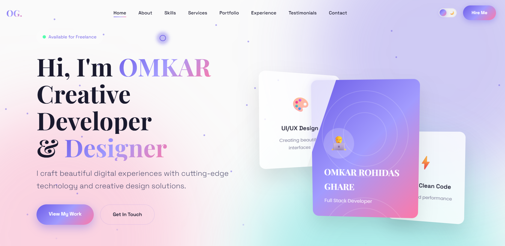

# 🚀 Personal Portfolio Website Template — V7

A premium responsive portfolio website template crafted for developers, UI/UX designers, freelancers, and digital creators.

Designed with modern layouts, clean aesthetics, and interactive sections to deliver an engaging user experience.

---

## ✨ Features

- Premium Modern UI
- Fully Responsive Layout
- Interactive Navigation
- Smooth Animations
- Professional Project Showcase
- Skills & Experience Sections
- Contact Interface
- Optimized Performance
- Clean Folder Structure
- Easy Customization

---

## 🛠️ Built With

- HTML5
- CSS3
- JavaScript
- Responsive Web Design

---

## 📸 Project Preview



---

## 📁 Folder Structure

```bash
├── index.html
├── assets
│   ├── css
│   ├── js
│   └── images
           └── Preview.png
```

---

## 🎯 Project Goal

To create a visually appealing and professional portfolio template suitable for personal branding and showcasing web development skills.

---

## 👨‍💻 Developed By

**Omkar R. Ghare**

---

## 📄 License

Free for educational and personal use.
